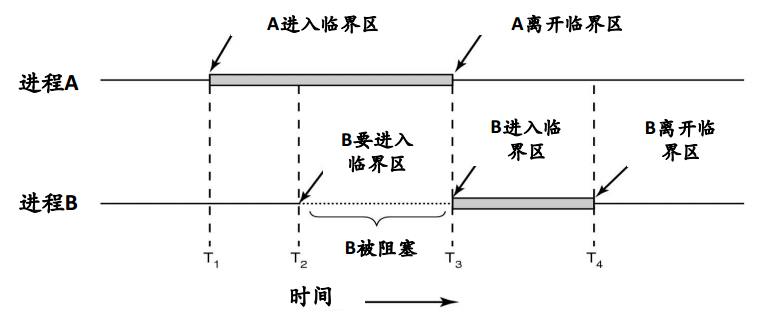

# IPC(Inter Process Communication) 进程间通信

- **竞争条件**

多个进程(线程)通过共享内存(或者共享文件)的方式进行通信会出现竞争条件. 竞争条件, 通俗的说, 就是
两个或者多个进程读写某个共享数据, 而最后的结果取决于进程运行的精确时序.

- **临界区**

程序可以分为两个部分: 不会导致竞争条件的程序片段和会导致竞争条件的程序片段. 会导致竞争条件的程序
片段称为临界区. 避免竞争条件只需要阻止多个进程同时读写共享数据就可以了, 也就是保证同时只有一个进
程处于临界区内.

## 锁

**锁就是保证只有一个进程处于临界区一种机制.**

### 操作系统的锁

- **硬件**

- **软件**